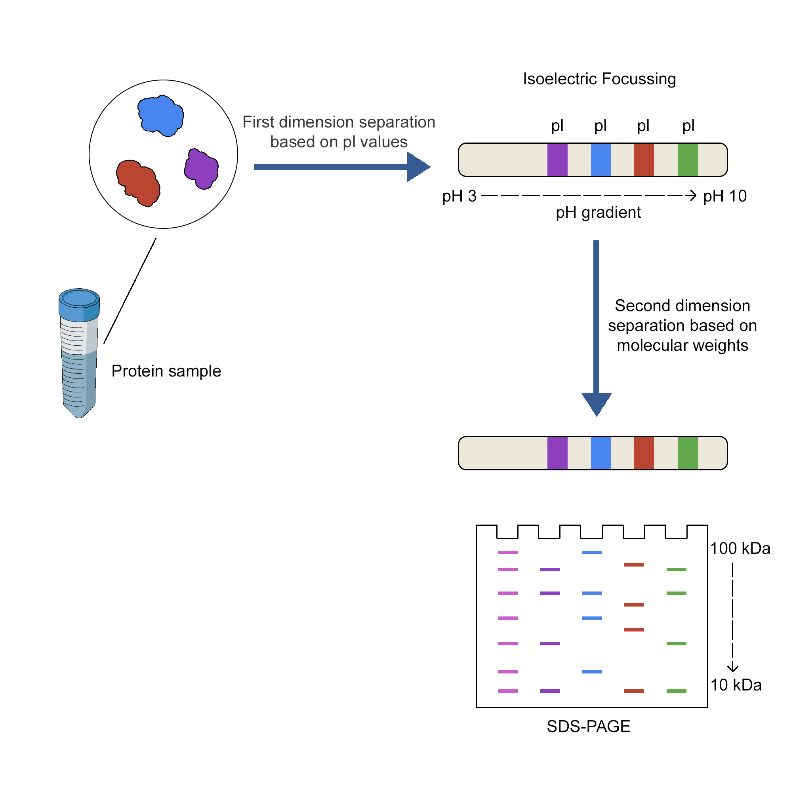

### Aim 

2-D gel electrophoresis (2DE) is a powerful tool in proteomics that combines two techniques namely Isoelectric focussing (IEF) and Sodium dodecyl sulphate-polyacrylamide gel electrophoresis (SDS-PAGE) to separate and analyze a mixture of complex proteins extracted from biological samples. Proteins are first separated in first dimension with IEF according to their pI values and then separated in second dimension with SDS-PAGE according to their molecular weight. Proteins with comparable molecular weights but different pI values or proteins with similar pI values but different molecular weights can be separated using 2D gel electrophoresis. Thereby, thousands of proteins in a complicated mixture can be isolated and characterised in terms of quality, pI value, mass etc.

 

