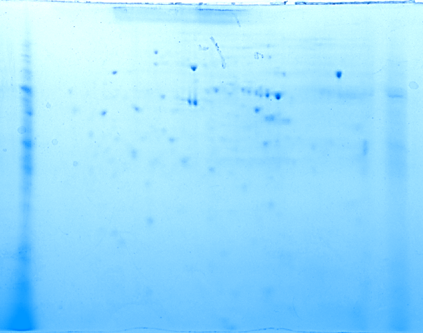

### Procedure

 

* <b>Buffers and Reagents</b>:  
* <b>Protein Sample</b>: Lyophilized protein sample. Protein sample should contain 2.5–3 mg of total protein at a concentration of 1.3 –1.5 mg/ml.  
* <b>Rehydration/Sample Buffer</b>: Rehydration buffer consists of 10 ml of 8 M urea, 50 mM dithiothreitol (DTT), 2% CHAPS, 0.2% (w/v) Bio-Lyte® 3/10 ampholytes, and trace of Bromophenol Blue.  
* <b>Nanopure Water</b>: Autoclaved milli-q water.  
* <b>Equilibration Buffer I</b>: Equilibration buffer I consists of 20 ml of 6 M urea, 2% SDS, 0.375 M Tris-HCl (pH 8.8), 20% glycerol, and 2% (w/v) DTT.  
* <b>Equilibration Buffer II</b>: Equilibration buffer II consists of 20 ml of 6 M urea, 2% SDS, 0.375 M Tris-HCl (pH 8.8), and 20% glycerol.  
* 30 % Glycerol Solution:  
* <b>Iodoacetamide</b>: 0.5 gram of an ultrapure iodoacetamide  
* <b>Overlay Agarose</b> Consists of 50 ml of 0.5% low melting point agarose in 25 mM Tris, 192 mM glycine, 0.1% SDS, and a trace of Bromophenol Blue.  

#### Step-1 Sample Application During Rehydration:

* Take desired number of IPG strips (pH 4-7) generally two for each sample from deep freezer and keep it aside until it comes to room temperature. Place rehydration/equilibration tray on the working bench. It should be preferably of same size as of IPG strip.
* Reconstitute lyophilized protein sample in 2 ml of the freshly prepared rehydration/sample buffer and mix it gently. Do not keep on ice as urea will crystallize out of solution.
* Pipet 125 µl (For 7 cm strip) of the reconstituted protein sample as a line along the edge of channel on rehydration/equilibration tray leaving 1 cm gap at each end. Avoid air bubbles as it might interfere with the even distribution of sample in the strip.
* Repeat this process for all other protein samples. After loading all the protein samples on the tray, peel off the coversheet of IPG strips using forceps and place it gently onto the sample. Make sure that gel side on the IPG strips is downwards. Keep it for 1hour for strips to rehydrate.
* After 1 hour, overlay each of the strips with 2 to 3 ml of mineral oil to prevent evaporation during the rehydration process. Cover the tray with lid and keep it on the level bench overnight.

#### Step-2 Isoelectric Focusing:

* Place IEF focusing tray onto the work bench. Make sure focusing tray is of the same size as the rehydrating IPG strips.
* Make paper wick wet with nanopore water. Using forceps, put a paper wick at both ends of the channels covering the electrodes. Keep numbering same as those at the time of rehydration.
* Remove the lid of the rehydration/equilibration tray containing the IPG strips. Hold the strips vertically for 10 seconds using forceps, allow the mineral oil to drain. Draining removes unabsorbed protein thereby reducing horizontal streaking. Transfer IPG strips to the focusing tray maintaining the numbering and orientation of gel on the strip.
* Overlay IPG strips with 2-3 ml of mineral oil. Avoid any air bubbles and then place focusing tray on the focusing machine. Close the cover and start isoelectric focusing. For all strips, default temperature should be 20 ˚C.

#### Step-3 Staining of IPG Strips

* Place IPG strips on the blotting paper with gel side facing up. Place wet filter paper above it and press it slightly over the entire length of the strip. This will remove mineral oil from the surface of IPG strip.
* Pour 50 ml of Bio-safe Coomassie stain in the tray and transfer one of the IPG strip into it. Keep the tray on rocker for 1 hour. Another IPG strip can be stored in deep freezer.
* After 1 hour, discard the staining solution and place the strip on the destaining solution and place it on rocker for 10 minutes. Repeat this step, until destaining is complete. Keep changing destaining solution, this will hasten the destaining process.
* After complete destaining, pattern of protein bands on the IPG strip can be observed, this will make sure that isoelectric focusing and sample preparation was correct.

#### Step-4 Equilibrations of IPG strips for 2 nd dimension separation on SDS-PAGE

* Remove IPG strip from deep freezer and thaw it until strip color turns clear.
* Pour 2.5 ml of Equilibration Buffer I on the tray and transfer thawed IPG strip on the tray. Place the tray on orbital shaker at slow speed for 10 minutes.
* Add iodoacetamide to Equilibration Buffer II. Post 10 minutes incubation, decant Equilibration Buffer I. Pour 2.5 ml of Equilibration Buffer II and transfer IPG strip into it. Place the tray on orbital shaker at slow speed for 10 minutes.
* Meanwhile, warm the overlay agarose for 30 seconds in microwave. Swirl the agarose solution and repeat until agarose liquifies completely.
* Decant the equilibration buffer II from the tray.

#### Step-5 SDS-PAGE

* Prepare 8-16% polyacrylamide gels or readymade precast gels can also be used.
* Remove the IPG comb and rinse gel with nanopore water and keep it in tray until further use.
* Prepare 1X SDS-PAGE Running buffer
* Fill 50 ml falcon tube or measuring cylinder with 1X SDS-PAGE running buffer. Carefully remove IPG strip from Equilibration buffer II and dip into running buffer for 10 seconds.
* Fill the IPG well in the gel with overlay agarose and then carefully place IPG strip in the well using forceps. Avoid any air bubbles and empty spaces between gel and IPG strip.
* Keep the setup as it is for 5 minutes and allow the overlay agarose to dry.
* Fix the glass plates with gel and strip into the running apparatus. Fill the tank with 1X SDS-PAGE running buffer.
* Set the voltage 200 volts and time 40 minutes. Start the electrophoresis run.

#### Step-6 Staining

* <b>Coomassie stain</b> (500 ml)- 0.5-gram Coomassie R-250, 50 ml glacial acetic acid, 20 ml methanol, 250 ml double distilled water.
* <b>Destaining solution</b> (500 ml)- 100 ml methanol, 50 ml glacial acetic acid, 350 ml double distilled water.
* Pour enough Coomassie Brilliant Blue R-250 in the tray so that it covers the gel completely and then keep the tray on orbital shaker for 1 hour.
* After staining is complete. Put the gel in destaining solution. Keep changing the destaining solution on regular intervals until the background is clear.

<b>Imaging</b> 

Imaging of 2D gel can be performed using densitometer or CCD camera based Chemi-Doc system.

<b>Analysis of 2D-gel images</b> 

Analysis of 2D-gel images is done using softwares that detect and measure the intensity of protein spots on the gel. Protein spot quantification and comparison between two gels can also be performed using these softwatres. These softwares are based on image-segmentation techniques and complex sophisticated algorithms. Protein spots can also be identified by excising the spots from the gel and sending it for LC-MS analysis.

<b>Results</b> 

 

