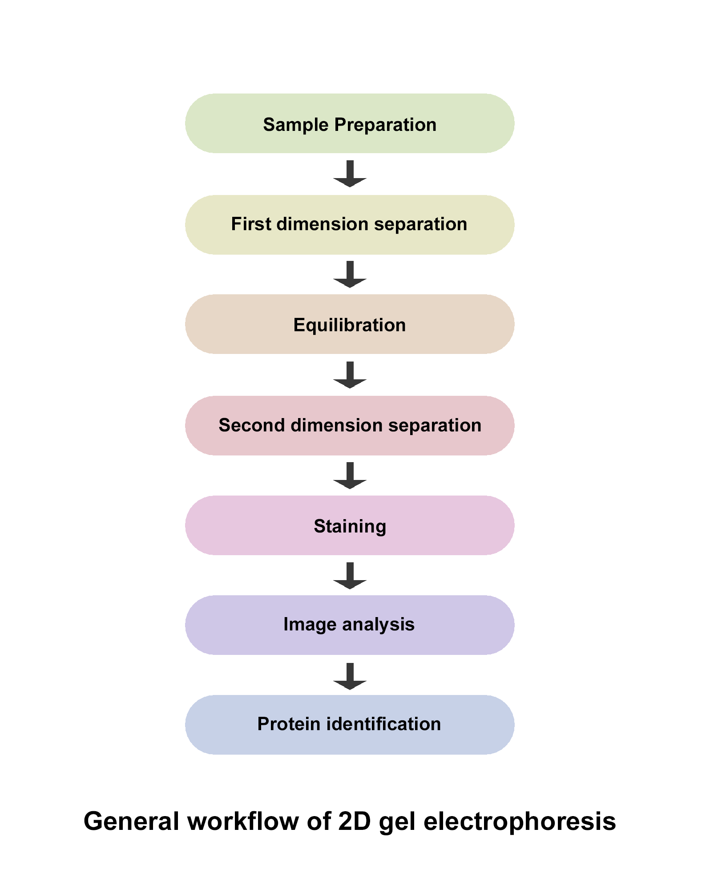

### Theory 

#### Overview of 2D Gel Electrophoresis

Following steps are involved in a successful 2D gel electrophoresis.

* Sample preparation
* Isoelectric focussing
* Equilibration
* SDS-PAGE
* Protein detection and analysis

So, even though the name of 2D gel electrophoresis suggest a two-step process, it’s a five step process as follows :

 

<b>Sample preparation:</b> In order to characterize specific proteins in a complex mixture of proteins, the proteins of interest should be completely solubilised before loading onto IEF gel. Different proteins require different treatments and conditions to get solubilised. First thing to be kept in mind is that charge of proteins should not get altered in anyway. So, charged detergents such as SDS cannot be used for solubilising proteins. Therefore, uncharged chemicals are used for extracting cellular proteins and denature them keeping in solution. IEF compatible lysis reagents such as neutral detergents like CHAPS, and chaotropes like Urea are used. Mostly combination of detergents and chaotropes is used for solubilisation of proteins. The effectiveness of solubilisation depends on many factors like cell disruption technique, protein concentration and dissolution technique, detergents, and composition of sample. Thus, sample specific optimization is required for this step to avoid any protein loss.

<b>Isoelectric focussing:</b> IEF or isoelectric focussing is the separation of proteins based on their pI or isoelectric point. The pI of a protein is the pH at which a protein carries no negative charge and the electrophoretic mobility of a protein at this pH is zero. At a pH above the isoelectric point, a protein carries negative charge and moves towards the anode whereas at a pH below the isoelectric point, a protein carries positive charge and moves towards the cathode. An IEF gel is a polyacrylamide gel without SDS and carries a pH gradient. The pH gradient is created by using a mixture of small multi-charged polymers called carrier ampholytes that are injected in a glass tube while casting the gel. Another way of creating a pH gradient is using the immobilized pH gradient (IPG) strips in which pH gradient is covalently incorporated into acrylamide matrix and then immobilized. Commercially available IPG strips have overcome the limitations of unstable and inconsistent pH gradient associated with carrier ampholytes based IEF gels.

The proteins samples are loaded onto IEF gel and subjected to electric field and moves towards the anode or cathode depending on the negative or positive charge. When a protein migrates through the pH gradient in gel, it either picks or loses protons. The net charge and mobility of the protein also decreases and the protein slows down. It eventually arrives at a point in the pH gradient where the pH is equal to its isoelectric point i.e. pI. At this point the overall charge of the protein is zero and migration stops. In this way, different proteins get separated on the basis of difference in their pI values.

<b>Equilibration:</b> After first dimension separation, the IEF gel or IPG strip is equilibrated in SDS buffer before second dimension separation. With this inter-dimension equilibration, the proteins separated in IEF gel get coated with SDS and denature. Thus, the proteins become mobile in second dimension for separation based on their molecular weights.

<b>SDS-PAGE:</b> After equilibration, the IEF gel or IPG strip is placed on the top of a slab Sodium dodecyl- Polyacrylamide gel (SDS-PAGE) and subjected to electric field. Since SDS denatures and coats the proteins with negative charge, the intrinsic charge of the protein is no longer involved in the separation and the proteins get separated based on their molecular weights as they migrate through the SDS-polyacrylamide gel.

<b>Protein detection and analysis:</b> Proteins separated in second dimension i.e., SDS-PAGE are visualized by staining the gel. Types of stains used for in-gel detection of proteins include Coomassie stains, silver stains and fluorescent stains.

<b>Coomassie stains:</b> Coomassie blue is the most common stain used for proteins detection in polyacrylamide gel. This dye binds to proteins Van der Waals attractions and forms protein-dye complexes. Sensitivity of Coomassie blue is moderate with good linearity and homogeneity. It is also compatible with mass spectrometry.

<b>Silver stains:</b> silver stain is more sensitive than Coomassie stains but the linearity and homogeneity is less than Coomassie stains. Silver ions can bind to the amino acid side chains, primarily the sulfhydryl and carboxyl groups of proteins and get reduced to free metallic silver. The protein bands can then be visualized as spots where reduction occurs. However, silver stains are not compatible for mass spectrometry as formaldehyde is required for development which interferes with sample preparation of mass spectrometry.

<b>Fluorescent stains:</b> fluorescent dyes like SYPRO Ruby provide the advantage of high sensitivity and compatibility with mass spectrometry. SYPRO Ruby has good linearity and the staining protocol is very simple. Moreover, most categories of proteins can be stained with SYPRO Ruby with very little protein to protein variation.

After the gel is stained with the staining dye of choice, it is imaged and analyzed with different software to identify the location and intensity of the separated proteins. The softwares can quantify the protein spots and hence, expression of different proteins can be compared. Alternatively, the spots can be excised from the gel and the proteins can be identified by mass spectrometry.

<b>Advantages of 2DE:</b>

* Hundreds to thousands of proteins can be analyzed simultaneously in a single gel.
* Complex mixtures of proteins can be separated using two different properties of proteins, isoelectric point, and molecular weight.

<b>Disadvantages of 2DE:</b>

* Limited dynamic range and less reproducibility.
* Time consuming and laborious process.
* Not automated for high-throughput use.

<b>Applications of 2DE:</b>

* Global protein expression can be studied.
* Differential protein expression can be studied.
* Post translational modification like phosphorylation, glycosylation etc., can be studied.
* Protein biomarkers expressed in different diseases can be identified.